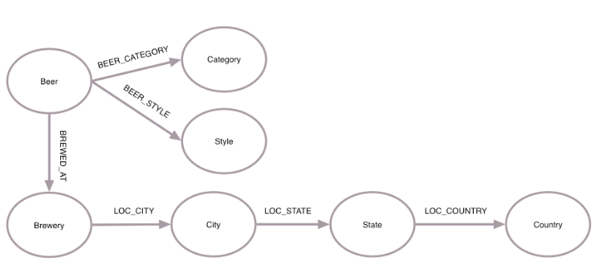

:toc:

= Neo4JGraphDB

image::images/neo4j_logo.png[]

In this workshop, we want to introduce you to the NOSQL Graph DB Neo4J. +
To do this, we will introduce you to its basic concepts, its query language and different advantages and uses. +
Following some short tutorials, you will also get some exercises to complete to get more familiar with the concept and language of Neo4J

== Assignment 1

- Open a terminal
- execute the following command to get an empty Neo4j DB:
..................
docker run \
   --publish=7474:7474 --publish=7687:7687 \
   neo4j:latest
..................
- open a browser and go to localhost:7474
- enter "neo4j" as the password
- choose a new password 
- Create a node of type “Person” with a property name that is set to your name. 
- Create a node of type “Hobby” with a property name that is set is to something that you like to do (e.g. “Programming”, “Reading”, …). 
- Create a new relationship between those two nodes called “LIKES”.
- Create some friends of type “Person” with a property name that have the relationship “FRIENDS” with your own node. 
- Find all your friends in the database. 
- Give at least one friend a hobby.

For help use the cheat sheet (https://github.com/sebivenlo/Neo4JGraphDB/blob/master/cypher_cheat_sheet.pdf).

..................
CREATE 	(:Person {name:"Lucas"})
..................

..................
CREATE 	(:Hobby {name:"Reading"})
..................

..................
MATCH 	(you:Person {name:"Lucas"})
MATCH	(hobby:Hobby {name:"Reading"})
CREATE 	(you)-[:LIKES]->(hobby)
..................

..................
MATCH	(you:Person {name:"Lucas"})
CREATE 	(a:Person {name: "Klaus"}),
		(b:Person {name: "Sandra"}),
		(c:Person {name: "Gertrude"}),
		
		(you)-[:FRIEND]->(a),
		(you)-[:FRIEND]->(b),
		(you)-[:FRIEND]->(c)
..................

..................
MATCH	(you:Person {name:"Lucas"})-[:FRIEND]->(friends)
RETURN	friends.name as name
..................

..................
MATCH	(friend:Person {name:"Klaus"})
CREATE	(hobby:Hobby {name:"Programming"}),
		(friend)-[:LIKES]->(hobby)
..................

== Assignment 2

- Open a terminal in the assignment 2 folder
- execute the following command to run the Neo4J browser (Linux + MAC): 
..................
docker run \
   --publish=7474:7474 --publish=7687:7687 \
   --volume=$HOME/(path to current location)/neo4j/data:/data \
   neo4j:latest
..................
Windows:
..................
docker run --publish=7474:7474 --publish=7687:7687 --volume=(path to current location)/neo4j/data:/data neo4j:latest
..................
- Open your browser and go to localhost:7474

- Password: 1234

- Try to create the following Queries:
   
=== Queries

. Breweries of the United States
.. Find all the breweries that are located in the United States.

. Beers in a particular city
.. Find all the beers & breweries from San Francisco, California.

. Beers with the highest alcohol content
.. Find the top 10 beers with the highest alcohol content (abv)

. Beers with the lowest alcohol content
.. Find the top 10 beers with the lowest alcohol content (abv > 0) 

. Beers of a certain category
.. Find all the beers of the category "North American Lager".

. Beers for a particular style and location
.. Find all the beers that are brewed in the style "Porter" in the United States.

For help use the cheat sheet (https://github.com/sebivenlo/Neo4JGraphDB/blob/master/cypher_cheat_sheet.pdf).

..................
MATCH 	(brewery: Brewery)-[:LOC_CITY]->(city:City)-[:LOC_STATE]->(state:State)-[:LOC_COUNTRY]->(country:Country)
WHERE	country.country="United States"
RETURN 	DISTINCT(brewery.name) AS brewery, country.country AS country
..................

..................
MATCH 	(beer:Beer) - [:BREWED_AT] -> (brewery: Brewery) - [:LOC_CITY] -> (city:City {city: 'San Francisco'}) - [:LOC_STATE] -> (state:State {state: 'California'})
RETURN 	DISTINCT(beer.name) AS beer, brewery.name AS brewery, brewery.address1 AS address
..................

..................
MATCH 	(beer:Beer) - [:BREWED_AT] -> (brewery: Brewery)
RETURN 	beer.name AS beer , beer.abv, brewery.name AS brewery, brewery.city AS city, brewery.state AS state , brewery.country AS country
ORDER BY beer.abv DESC
LIMIT 10
..................

..................
MATCH 	(beer:Beer) - [:BREWED_AT] -> (brewery: Brewery)
WHERE 	beer.abv > 0
RETURN 	beer.name AS beer , beer.abv, brewery.name AS brewery, brewery.city AS city, brewery.state AS state , brewery.country AS country
ORDER BY beer.abv
LIMIT 10
..................

..................
MATCH 	(category:Category {category: "North American Lager"}) <- [:BEER_CATEGORY]- (beer:Beer) - [:BREWED_AT] -> (brewery: Brewery) - [:LOC_CITY] -> (city:City) - [:LOC_STATE] -> (state:State) - [:LOC_COUNTRY] -> (country:Country)
RETURN 	DISTINCT(beer.name) AS beer, brewery.name AS brewery, city.city AS city, state.state AS state , country.country AS country
ORDER BY country , beer
..................

..................
MATCH (style:Style {style: 'Porter'}) <- [:BEER_STYLE] - (beer:Beer) - [:BREWED_AT] -> (brewery: Brewery) - [:LOC_CITY] -> (city:City) - [:LOC_STATE] -> (state:State) - [:LOC_COUNTRY] -> (country:Country {country:"United States"})
RETURN DISTINCT(beer.name) AS beer, brewery.name AS brewery, city.city AS city, state.state AS state , country.country AS country
ORDER BY beer
..................

=== Schema

(Beer)

- name: beer name

- abv: alcohol by volume

(Brewery)

- name: brewery name

- address1

- city

- state

- country

- code

- latitude

- longitude

- phone

- website

(Category)

- category

(City)

- city

- state

- country

(State)

- state

(Country)

- country

(Beer) - [:BREWED_AT] → (Brewery)

(Beer) - [:BEER_CATEGORY] → (Category)

(Beer) - [:BEER_STYLE] → (Style)

(Brewery) - [:LOC_CITY] → (City) - [:LOC_STATE] → (State) - [:LOC_COUNTRY] → (Country)

== Assignment 3

- Open a terminal
- execute the following command to an empty Neo4j DB:
..................
docker run \
   --publish=7474:7474 --publish=7687:7687 \
   neo4j:latest
..................
- open a browser and go to localhost:7474
- log in using the new password set in assignment 1
- There should still be data here, if you do not mind losing this data, execute the following:
............
MATCH (n) DETACH DELETE n
............
If you do not delete your old data, this will very likely not lead to complications, you should just get more data unrelated to this assignment when looking at the whole graph
- Execute the following command:
......
:play movies
......
- Click on the script that shows up in the feed and execute it
- Show the whole graph and get a little familiar with the data

=== Queries

. Actors that acted together in multiple movies
.. Find all the actors that acted together in more than one movie

. Amount of movies for Robin Williams co-stars
.. Find the average amount of movies that actors played in who played in at least one movie with Robin Williams

. Use shortestPath to find actors who like to play together
.. Using shortestPath, find all actor pairings who played in more than one movie together

. How close are people from "The Green Mile" and "When Harry met Sally"
.. Find the shortest shortestPath between people who are affiliated with "The Green Mile" and people who are affiliated with "When Harry met Sally"

. Average age of actors who played in movies with Keanu Reeves
.. Find the average age of all actors who played in movies with Keanu Reeves, using the age that they had when they plaed in the specific movie

For help use the cheat sheet (https://github.com/sebivenlo/Neo4JGraphDB/blob/master/cypher_cheat_sheet.pdf).

=== Schema

No schema this time, try to find the relevant data on your own!
